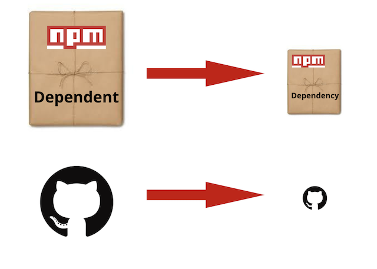
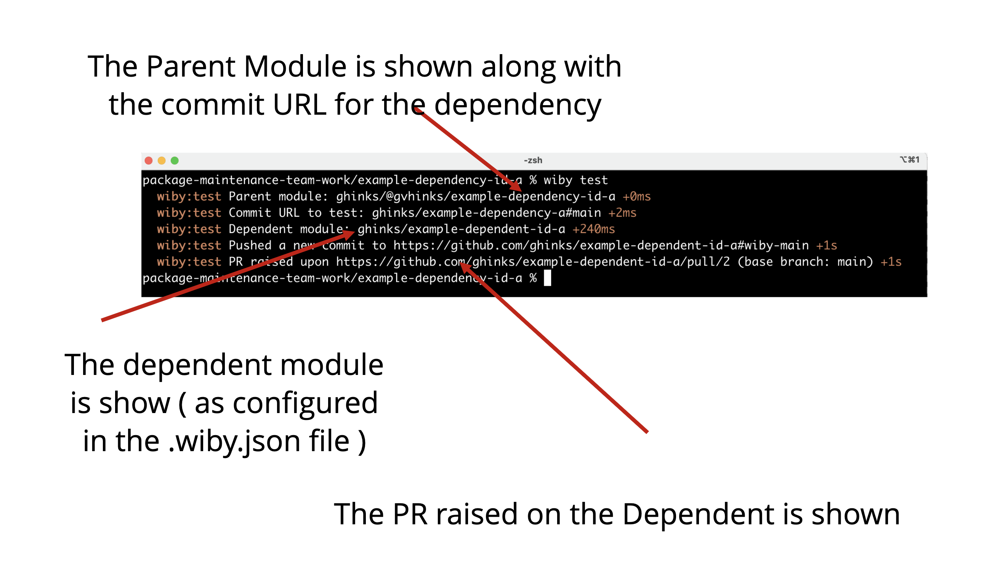
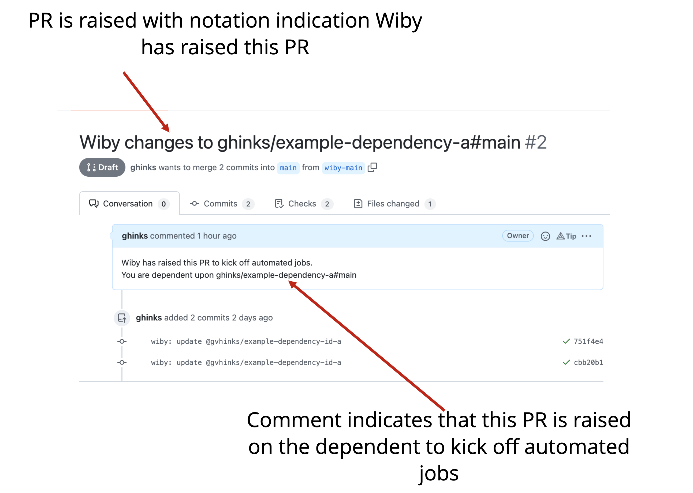

# WIBY (**W**ill **I** **B**reak **Y**ou)

A tool for testing dependents

This repository is managed by the [Package Maintenance Working Group](https://github.com/nodejs/package-maintenance), see [Governance](https://github.com/nodejs/package-maintenance/blob/master/Governance.md).

## Purpose
Wiby is a tool that will inform and trigger actions on a package to notify it that a registered dependency change may break
it. This is different from triggering tests once a dependency has been published. The goal is to inform before publication.
This will answer the question, "will I break you?", not "did I break you?".

The most basic notification of a change in a dependency will be a PR raised in the the dependent repository.

### Terminology
The term **depenedent** shall mean an npm package that consumes another npm package, called a **dependency**, directly
or indirectly via a tree of reliance through the package.json file. The **wiby** program exists to create a notification to the *dependent*
package maintainers of changes made in a dependency. The **WIBY** program, when configured correctly, will raise a Pull
Request against the dependent package informing of the change. The **intent** is to provide a notification of possible
breakages of the dependent due to reliance on a dependency. No distinction is made between dev and non-dev dependencies.
They are all dependencies that could break "the-example-dependent" in some operational or test manner. It is noted that
in general dependent and dependencies are modules they can equally be repositories. For the purpose of this readme examples
use github.



## Pre-requisites

### Github Token

wiby requires an environment variable `GITHUB_TOKEN` set to a Github access token. This token needs to be granted push
permissions to the dependent repos.

Example: `export GITHUB_TOKEN=XXXXX`

For more information on creating a github token see [Github's docs](https://docs.github.com/en/github/authenticating-to-github/creating-a-personal-access-token)

### Running location

wiby is designed to be run from inside the folder containing your source code. This folder needs to be a git repository with a `package.json` that contains information about the packages source on Github.
Example:

```
{
...
  "repository": {
    "type": "git",
    "url": "https://github.com/ORGNAME/REPONAME.git"
  }
...
}
```

## Available commands

[wiby test](./USAGE.md#wiby-test)    Test your dependents

[wiby result](./USAGE.md#wiby-result) Fetch the results of your tests

## Development

- This repository uses `semantic-release` with default configuration.
- Create a new release by running `npx semantic-release`.
## Examples

The following is the most simple use case.

The dependent npm package has the following package.json file
```json
{
  "name": "example-dependent-id-a",
  "version": "1.0.0",
  "main": "index.js",
  "scripts": {
    "test": "tap test.js"
  },
  "repository": {
    "type": "git",
    "url": "git+https://github.com/ghinks/example-dependent-id-a.git"
  },
  "license": "ISC",
  "bugs": {
    "url": "https://github.com/ghinks/example-dependent-id-a/issues"
  },
  "homepage": "https://github.com/ghinks/example-dependent-id-a#readme",
  "devDependencies": {
    "tap": "^15.1.2"
  },
  "dependencies": {
    "@gvhinks/example-dependency-id-a": "^0.0.0-development"
  }
}
```
In this simple case the **dependent** package is called "example-dependent-id-a" and the dependencies are
* tap
* @gvhinks/example-dependency-id-a

If WIBY were configured in the dependencies ***@gvhinks/example-dependency-id-a * then changes in the that
dependency would raise a Pull Request agaist the "example-dependent-id-a" when the WIBY command was run within this
repository.

## Example 1, simply dependent breakage check run locally
Given a dependent, example-dependent-id-a, and its dependency example-dependency-id-a the following steps are required
to raise a notification against the dependent of changes in the dependency.

- install wiby as a dependency of example-dependency-id-a
- create the .wiby.json configuration file
- ensure that GITHUB_TOKEN is exported
- run wiby test in the dependency example-dependency-id-a

This will raise a PR against the dependent configured in the .wiby.json configuration file.

### Step #1 Install Wiby
```shell
npm i wiby -D
```

### Step #2 create the .wiby.json configuration file

```shell
echo '{
  "dependents": [
    {
      "repository": "https://github.com/ghinks/example-dependent-id-a.git",
      "pullRequest": true
    }
  ]
} ' > .wiby.json
```

### Step #3 ensure GITHUB_TOKEN is exported

```shell
export GITHUB_TOKEN=XXXXX
```

### Step #4 Run Wiby locally

```shell
wiby test
```



This raises a PR against the dependent as specified in the ".wiby.json" file



